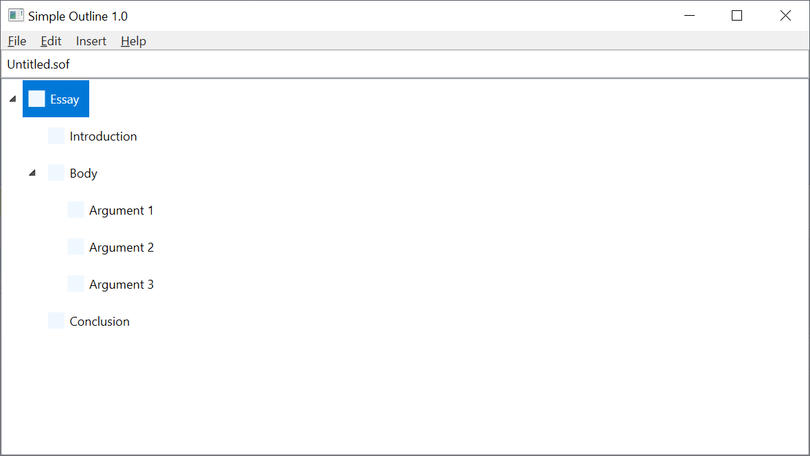

# SimpleOutline

An application for creating outlines for prose compositions.

## Features
1. Allows the user to save and open outline documents.
2. Allows the user to insert a topic where the selected topic is.
3. Allows the user to insert a topic right below the selected topic in the tree. If the next topic is already nested in the selected topic, the new topic will be nested in it.
4. Allows the user to rename the selected topic. (Just press enter to begin renaming it.)
5. Allows the user to nest and un-nest the selected topic. (Move In and Move Out options. Will be renamed in the near future.)
6. Allows the user to move the selected topic up and down.
7. Allows the user to cut and copy the selected topic.
8. Allows the user to paste, replacing the selected topic with the one stored in the clipboard.
9. Allows the user to export the outline to a very simple html file (web page). The user can then open the html file in a word processing program of their choice and format it.
10. Has context menus
11. Has keyboard shortcuts.
12. Does not have a toolbar yet, but one will be added.

## Screenshots

